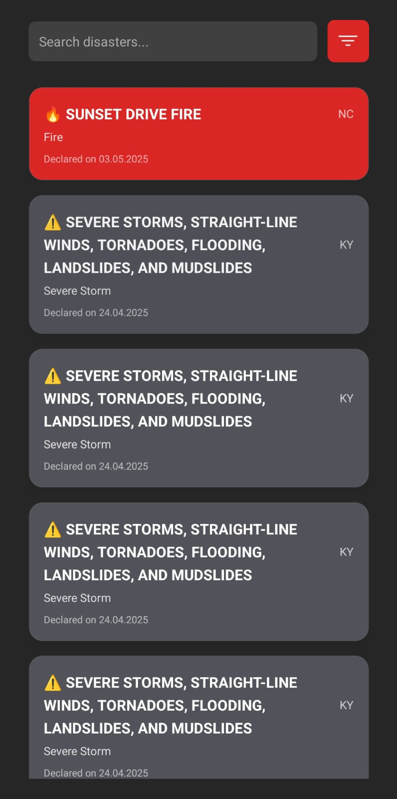

# AlertScope

**AlertScope**, afet bildirimlerini merkezi ve yapılandırılmış bir formatta kullanıcıya sunmayı amaçlayan bir açık kaynak projedir. Proje, ABD Federal Acil Durum Yönetim Ajansı (FEMA) tarafından sağlanan [OpenFEMA API](https://www.fema.gov/about/openfema/api) üzerinden veri çekerek gerçek zamanlı afet uyarılarını izlemeye ve analiz etmeye olanak tanır.

## 🚨 Proje Amacı

AlertScope, afet yönetimi, kriz bilgilendirmesi ve risk analizi gibi alanlarda operasyonel verimliliği artırmayı hedefleyen modern bir uyarı takip sistemidir. Uygulama, API üzerinden alınan resmi bildirimleri filtreleyerek uçtan uca bir uyarı yönetimi akışı sağlar.

## 🔗 Kullanılan API

Bu proje, aşağıdaki FEMA kaynağını kullanmaktadır:

- **OpenFEMA API**
  - URL: [https://www.fema.gov/about/openfema/api](https://www.fema.gov/about/openfema/api)
  - Kullanım Amacı: Afet olayları, bildirimler, tahliye bilgileri ve bölgesel uyarıların elde edilmesi.
  - API Endpoint: `https://www.fema.gov/api/open/v2/DisasterDeclarationsSummaries`

## ⚙️ Teknolojiler

- Python 3.10+
- Requests
- JSON parsing
- (İsteğe bağlı) Pandas / Flask / FastAPI (Kullanım senaryonuza göre eklenebilir)

---
## 📸 Uygulama Ekran Görüntüsü

Aşağıda AlertScope ana ekranına ait örnek bir görüntü yer almaktadır:

<table>
  <tr>
    <td align="center">
       
      Ana Ekran
    </td>
  </tr>
</table>
